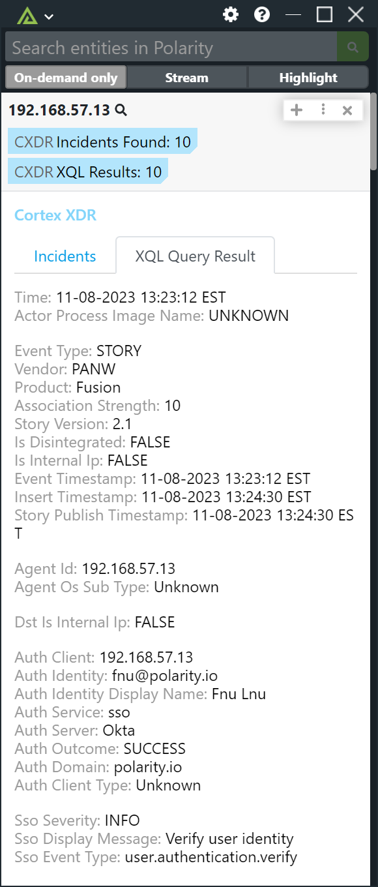
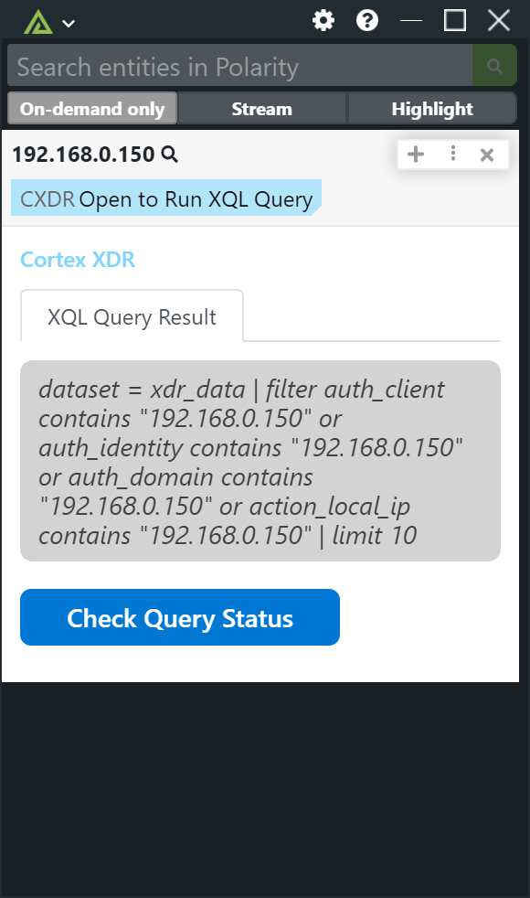
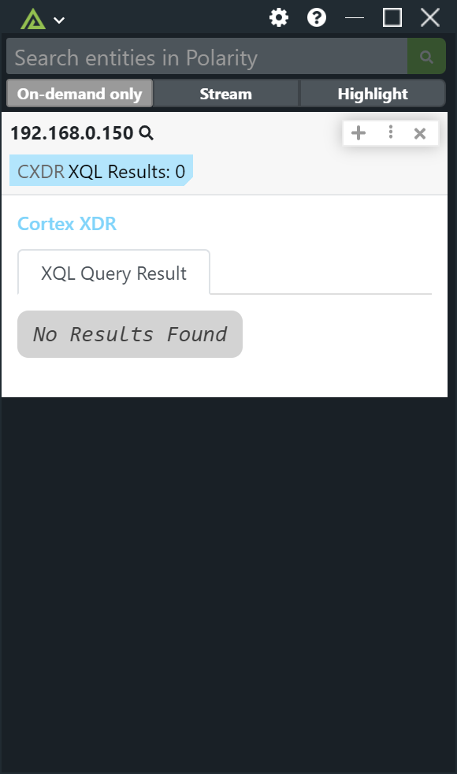

# Polarity Cortex XDR Integration

Cortex XDR allows you to safeguard your organization with proven endpoint security, detection, response, automation and attack surface management.

The Polarity Cortex XDR Integration allows you to search for Incidents and run XQL Queries.  Due to limits on the number of XQL queries that can be running at any given time, the integration only runs the provided XQL query when a user opens the details block for the entity in question. Once the XQL query has started, the user can check on the status of the query.  Once the query is complete, results will be displayed in the Overlay Window.

  
  

  
  

To learn more about Cortex XDR, visit the [official website](https://www.paloaltonetworks.com/cortex/cortex-xdr).

>***NOTE:*** When searching incidents only the incident's description field can be searched due to limitations with the Cortex XDR API.

> ***NOTE:*** If you would like us to display more fields for XQL Queries, please reach out to support@polarity.io.  
> We are happy to add additional fields as requested.

## Cortex XDR Integration Options

### API URL
The API Url for your Cortex XDR instance. NOTE: This is not the same as your Cortex XDR instance URL, but can be found at Configuration -> API Key -> Copy API URL.

### API Key
An API Key on your Cortex XDR instance. Configuration -> API Key

### API Key ID
The ID associated with your API Key. Configuration -> API Key -> ID Column

### Run XQL Query
If enabled, the integration will run the XQL Query specified by the "XQL Query String" option below. The XQL Query is run in addition to searching incidents.

This option should be set to be visible by all users.

### XQL Query String
The XQL Query you want to use when Searching Entities.  Example: `dataset = xdr_data | filter agent_id contains "{{ENTITY}}" or agent_hostname contains "{{ENTITY}}" or agent_ip_addresses contains "{{ENTITY}}"  | limit 10`

The string `{{ENTITY}}` will be replaced by the searched entity.

If the XQL Query String option is visible to the user, the query string will be displayed in the Overlay Window.

## Installation Instructions
Installation instructions for integrations are provided on the [PolarityIO GitHub Page](https://polarityio.github.io/).

## Polarity
Polarity is a memory-augmentation platform that improves and accelerates analyst decision making. For more information about the Polarity platform please see:

https://polarity.io/
